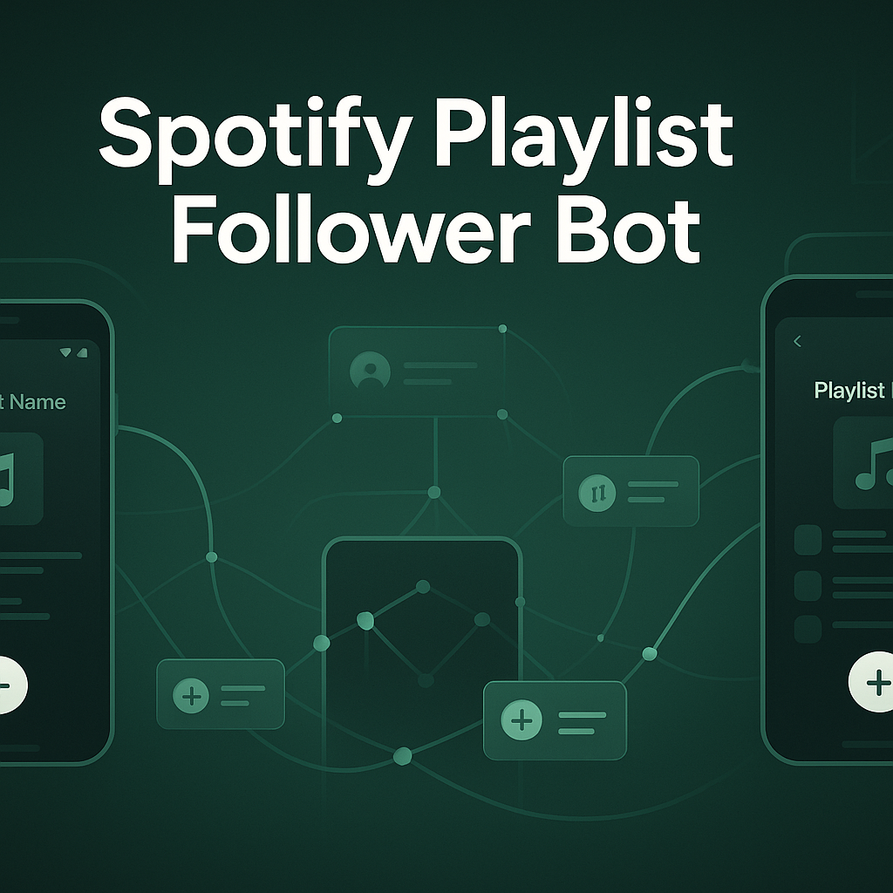

# Spotify Playlist Follower Bot

Automate following Spotify playlists at scale across multiple Android devices and accounts. This bot reads target playlist URLs, genres, or keywords, then executes human-like follow actions from real devices or emulators, ensuring steady, low-risk growth and streamlined campaign workflows. Built for reliability, concurrency, and stealth — perfect for agencies and power users who need consistent results.

<p align="center">
  <a href="https://Appilot.app" target="_blank">
    
  </a>
</p>
<p align="center">
  <a href="https://t.me/devpilot1" target="_blank">
    
  </a>&nbsp;
  <a href="https://wa.me/923249868488?text=Hi%20Appilot%2C%20I'm%20interested%20in%20automation." target="_blank">
    
  </a>&nbsp;
  <a href="mailto:support@appilot.app" target="_blank">
    
  </a>&nbsp;
  <a href="https://appilot.app" target="_blank">
    
  </a>
</p>

<p align="center"> 
   Created by Appilot, built to showcase our approach to Automation!<br>
   <strong>If you are looking for custom Spotify Playlist Follower Bot, you've just found your team — Let’s Chat.👆👆</strong>
</p>

## Introduction
This system automates the process of discovering and following Spotify playlists using Android devices and emulators. It eliminates repetitive manual actions like opening Spotify, searching or pasting playlist links, navigating to profiles, and tapping “Follow,” while managing multi-account hygiene, proxies, and anti-detection behaviors.

### Automating Spotify Playlist Following
- Ingest a CSV/JSON list of playlist URLs, genres, or search keywords, and auto-follow them from selected accounts.
- Schedule follow waves, throttle actions, and rotate proxies/device identities to match human patterns.
- Centralized logs, retries, and alerts enable quick troubleshooting and stable operations.
- Integrates with device farms to scale actions from dozens to hundreds of concurrent Android sessions.

- Bullet Highlights
  - Targets by URL, genre, keyword, or curator handle with configurable filters (public, followers count, recent activity).
  - Operates on **real Android devices and emulators**, including Bluestacks/Nox and cloud device farms.
  - **Human-like randomization** (delays, scroll depth, navigation paths) to minimize detection.
  - **Multi-account & multi-device orchestration** with per-account quotas, warmups, and cooldowns.
  - **Proxy & fingerprinting** ready (residential/mobile proxies, MultiLogin/AdsPower) for safer scaling.

## Core Features (must include 8–10)
- **Real Devices and Emulators:** Execute actions on physical Android phones or emulators (Bluestacks/Nox). Device-specific tuning improves stability and reduces ban rates for Spotify automation.
- **No-ADB Wireless Automation:** Control devices via network-based bridges and Accessibility/UI Automator so you’re not tethered by USB; ideal for racks and cloud farms.
- **Mimicking Human Behavior:** Randomized think-time, varied tap coordinates, inertial scrolls, intermittent backtracks, and occasional exploration to emulate authentic user sessions.
- **Multiple Accounts Support:** Manage credentials, session cookies, rotation rules, warming schedules, and per-account daily caps; isolate failures with sandboxed profiles.
- **Multi-Device Integration:** Scale from a single laptop to farms of 50–300+ devices using parallel workers, task queues, and per-device resource quotas.
- **Exponential Growth for Your Account:** Consistent, low-variance following behavior that compounds discoverability and network effects across playlists you care about.
- **Premium Support:** Priority fixes, scaling guidance, custom flows (e.g., “like N tracks after follow”), and private Slack/Telegram support channels.
- **Proxy & Fingerprinting Management:** First-class support for residential/mobile proxies and fingerprint containers (MultiLogin/AdsPower) to keep sessions clean.
- **Search & Discovery Pipelines:** Find playlists by keywords/genres and auto-filter by followers count, recency, or curator trust heuristics.
- **Task Scheduler & Quotas:** Cron-like scheduling, burst/wave execution, per-account/device quotas, and blackout windows to keep behavior organic.

**Additional Features (table)**

| Feature | Description |
|---|---|
| **Proxy Rotation & Health Checks** | Rotates residential/mobile proxies per account/device; latency and ban-signal health scoring to quarantine bad exits. |
| **Rate Limit & Cooldown Manager** | Central governor enforces per-minute/per-hour caps, randomized jitter, and recovery windows. |
| **Playlist Parser & Validator** | Validates Spotify playlist URLs, de-duplicates targets, and resolves canonical IDs before queuing. |
| **Scheduler & Queue Orchestrator** | Priority queues, backpressure control, and fair scheduling across accounts/devices for predictable throughput. |
| **Captcha Solver Integration** | Pluggable solvers (2Captcha/Anti-Captcha/CapSolver) with fallback routes and incident tagging. |
| **Audit Trail & Reporting** | Structured logs, per-action screenshots (optional), CSV/JSON exports, and Grafana-friendly metrics. |

</p>
<p align="center">
  <a href="https://bitbash.dev" target="_blank">
    
  </a>
</p>

## How It Works (must)
1. **Input or Trigger** — From the Appilot dashboard, upload a CSV/JSON with playlist URLs or define genre/keyword searches, choose accounts/devices, and set schedules/quotas.  
2. **Core Logic** — Appilot drives Android devices with UI Automator/Accessibility (with optional ADB) to launch Spotify, navigate to playlists, and press **Follow** using human-like flows.  
3. **Output or Action** — Follows are recorded with timestamps, device ID, account, proxy, and playlist metadata; exports and webhooks notify external systems.  
4. **Other functionalities** — Retries with backoff, error screenshots, structured logging, incident labeling, circuit breakers, and parallelism controls are configured from the dashboard.

## Tech Stack (must)
- **Language:** Kotlin, Java, Python, JavaScript  
- **Frameworks:** Appium, UI Automator, Espresso, Robot Framework, Cucumber  
- **Tools:** Appilot, Android Debug Bridge (ADB), Appium Inspector, Bluestacks, Nox Player, Scrcpy, Firebase Test Lab, MonkeyRunner, Accessibility  
- **Infrastructure:** Dockerized device farms, Cloud-based emulators, Proxy networks, Parallel Device Execution, Task Queues, Real device farm

## Directory Structure (must)
```
spotify-playlist-follower-bot/
│
├── src/
│ ├── main.py
│ ├── automation/
│ │ ├── runner.py
│ │ ├── device_manager.py
│ │ ├── spotify_flow.py
│ │ ├── humanizer.py
│ │ ├── proxy_manager.py
│ │ ├── rate_limiter.py
│ │ └── utils/
│ │ ├── logger.py
│ │ ├── config_loader.py
│ │ └── validators.py
│ ├── discovery/
│ │ ├── playlist_parser.py
│ │ └── search_pipeline.py
│ └── dashboard/
│ └── api_stub.py
│
├── config/
│ ├── settings.yaml
│ ├── accounts.csv
│ ├── targets.csv
│ └── credentials.env
│
├── logs/
│ ├── actions.log
│ └── device/
│ └── device-001.log
│
├── output/
│ ├── results.json
│ └── report.csv
│
├── tests/
│ ├── test_humanizer.py
│ ├── test_validators.py
│ └── test_rate_limiter.py
│
├── requirements.txt
└── README.md
```


## Use Cases (must)
- **Agencies** use it to auto-follow curated niche playlists for client accounts, so they can accelerate discovery and partnerships without manual grunt work.  
- **Playlist curators** use it to maintain reciprocal follow strategies at scale, so they can grow networks consistently and track outcomes.  
- **Growth teams** use it to test genres/segments programmatically, so they can validate which targets drive downstream engagement.  
- **Developers** use it to integrate follow actions into broader Spotify workflows, so they can unify pipelines and reporting.

## FAQs
**How do I configure this automation for multiple accounts?**  
Add your accounts to `config/accounts.csv` (or the dashboard), set per-account quotas and warmup schedules, and assign devices. The orchestrator enforces rotation, cooldowns, and isolation.

**Does it support proxy rotation or anti-detection?**  
Yes. It supports residential/mobile proxies, per-device bindings, and containerized fingerprints via MultiLogin/AdsPower. Health checks quarantine bad proxies automatically.

**Can I schedule it to run periodically?**  
Absolutely. Use the built-in scheduler to run hourly/daily waves with randomized jitter and blackout windows to keep behavior organic.

**What happens if Spotify layout changes?**  
Selectors are abstracted and versioned. Fallback locators, OCR hints, and manual override maps help recover quickly when UI shifts.

**Can it discover playlists by genre or keyword instead of URLs?**  
Yes. The discovery pipeline searches and filters playlists by keywords/genres and configurable heuristics (e.g., min followers), then queues valid targets.

## Performance & Reliability Benchmarks (must)
- **Execution Speed:** 100–200 follow actions/hour per 10-device pod under standard delays; horizontally scalable with additional pods.  
- **Success Rate:** ~95% follow confirmation on stable proxies and warmed accounts (measured across large runs).  
- **Scalability:** Proven patterns for 50–300 devices; architecture supports 1,000 with sharded queues and proxy pools.  
- **Resource Efficiency:** Lightweight workers (<250MB RAM each) with batched device I/O and lazy screenshots.  
- **Error Handling:** Exponential backoff, circuit breakers, targeted retries, incident tags, and structured logs ready for ELK/Grafana.

##

<p align="center">
<a href="https://cal.com/app-pilot-m8i8oo/30min" target="_blank">
  
</a>
</p>
